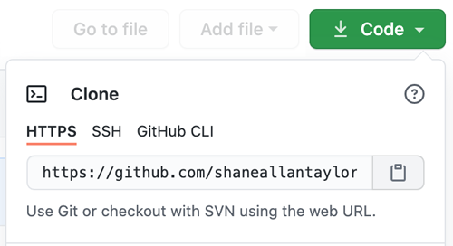

# Math to Code Precourse

Welcome!  This repo is designed to give everyone a code first introduction to mathematical symbols.  Mathematical symbols can seem daunting, but they are in fact relatively straight forward ways of denoting a bunch of operations you are already familiar with.  Derivatives, integrals and gradients are nothing more than applying the rules of addition, subtraction, division and multiplication in various ways.  

Most approaches towards familiarizing yourself with math rely on lots of abstractions, but one of the benefits of coding is that you can undertand concepts very explicitly to verify that you have the correct understanding of the abstract ideas.  

To work with ML on a regular basis you need to be fluent in various mathematical ideas and it's important to be able to conceptualize them when you encounter them in formal writing but also to see in your mind's eye how these ideas are represented in code.  

So to fast-forward our mathematical savviness we're going to try and code different mathematical ideas from scratch with bare python to check that we understand what different symbols refer to.  

To complete this portion, please open up the accompanying IPython notebook that will display different mathematical operators, and you'll have the chance to implement them in code with the data provided.  

There will be cells that follow that you can run to test your implementations.  

 # Forking & Cloning This Repo
1. Have __BOTH__ partners fork this repo
    - click on the __Fork__ button on the top right of the page
      <br></img>
    - click on your handle to fork to your repo

2. Each partner clones their own newly forked repo to their local machine
    - first, make sure you're on your new forked repo on GitHub
    - copy and paste GitHub url from the right side of the page
      <br></img>
    - enter the following line into your command line and insert your copied url instead of the quoted text:
      ```
      git clone 'copied url'
      ```
3. Each partner adds two remote links to their cloned repo on their own local workstation: one to CodesmithLLC's repo, and one to the partner's repo:
    ```
    git remote add upstream https://github.com/CodesmithLLC/dsml-unit-1
    ```
    ```
    git remote add partner https://github.com/PARTNERS_GITHUB_HANDLE/dsml-unit-1
    ```
   \* Make sure to edit the remote partner link with your partner's GitHub handle.
4. As you work remotely on your own workstation, periodically push your changes to your repo with `git push origin master`. Your partner can then use `git pull partner master` to get the changes onto their machine, followed by `git push origin master` to push those changes to their own GitHub repo!

Check out the [GitHub Documentation](https://help.github.com/articles/fork-a-repo/) for a more in-depth explanation of forking and cloning.

If working remotely, you'll want to make sure you have the VS Code extension [Live Share](https://marketplace.visualstudio.com/items?itemName=MS-vsliveshare.vsliveshare) installed. When working with your partner, one of you will need to share your copy of the unit via Live Share - this will allow you to both work together in the same VS Code editor. Note that when using Live Share, it will still be important for *both* partners to fork the challenge, and whoever is sharing should still regularly push changes to their repo. This will ensure that both of you consistently have access to the most recent version of your work.
